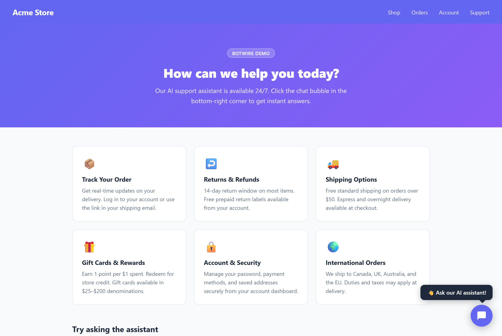
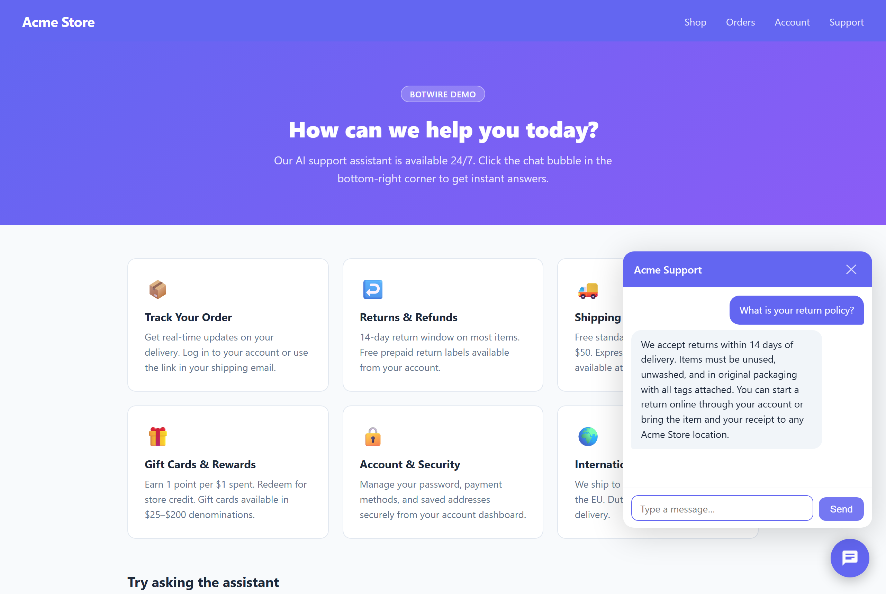
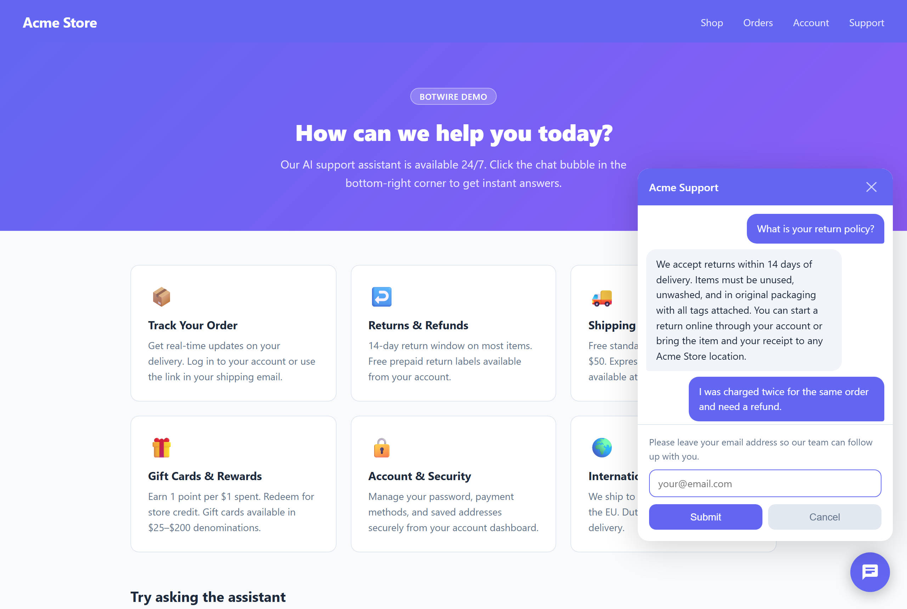
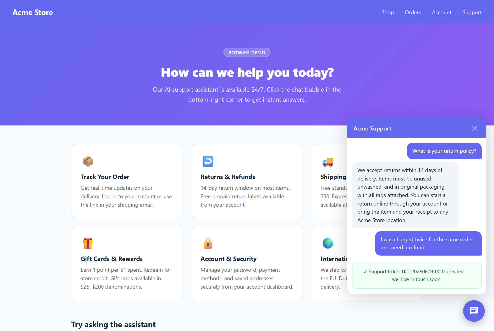

# BotWire

[](https://www.nuget.org/packages/BotWire.AspNetCore)
[](https://www.nuget.org/packages/BotWire.AspNetCore)
[](https://www.npmjs.com/package/botwire-js)
[](LICENSE)

**Low-cost AI customer-support for your .NET website.** Drop one NuGet package into your ASP.NET Core app, point it at your FAQ, and ship a 24/7 support assistant that answers customers instantly — and quietly opens a support ticket the moment a human is actually needed.

No SaaS seat fees. No per-conversation pricing. You bring your own OpenAI-compatible API key, so your only running cost is the model tokens — pennies per conversation with `gpt-4o-mini` or DeepSeek.

## Why BotWire

- **Cheap to run.** No platform subscription. Bring your own key; pay only for model tokens. Run it on `gpt-4o-mini`, DeepSeek, or any OpenAI-compatible endpoint to keep costs near zero.
- **One package, two lines of code.** `AddBotWire()` + `MapBotWire()`. The chat widget, streaming endpoint, escalation logic, and ticket email are all included.
- **Grounded in *your* docs.** Answers come only from the Markdown knowledge base you supply — no hallucinated policies, prices, or promises.
- **Knows when to get a human.** When a customer needs account/order access or asks for a person, BotWire collects their contact details and raises a support ticket instead of guessing.
- **Multilingual out of the box.** Replies in whatever language the customer writes in; you choose the language your team reads tickets in.
- **Zero-dependency widget.** A ~12KB Web Component (Shadow DOM, no framework) you embed with a single `<script>` tag.
- **Self-hostable & open.** AGPL-3.0. Your data and prompts stay in your app. Commercial licenses available if AGPL doesn't fit.

## Quick start

Install the package:

```powershell
dotnet add package BotWire.AspNetCore
```

Wire it up in `Program.cs`:

```csharp
builder.Services.AddBotWire(opts =>
{
    opts.TopicDescription = "Online store customer support";
    opts.Documents        = ["docs/faq.md"];
    opts.ChatProvider     = new OpenAIProviderOptions { ApiKey = "sk-...", Model = "gpt-4o-mini" };

    // Optional: email tickets to your team when the bot escalates.
    opts.Email = new EmailOptions
    {
        SmtpHost = "smtp.example.com", Port = 587,
        FromAddress = "support-bot@example.com", ToAddress = "support@example.com",
    };
});

app.UseCors();
app.MapBotWire();
```

Embed the widget on any page:

```html
<script src="/botwire/widget.js"></script>
<botwire-widget
    data-endpoint="/support"
    data-title="Acme Support"
    data-primary-color="#6366f1"
    data-position="bottom-right">
</botwire-widget>
```

That's it — the bot answers from `docs/faq.md` and raises tickets when it can't.

## See it in action



**1. The customer asks — BotWire answers from your FAQ, streaming token-by-token.**



**2. When the question needs a human, it collects contact details instead of guessing.**



**3. A support ticket is created and emailed to your team — the customer gets a confirmation.**



## Build your own frontend

The embedded `<botwire-widget>` is optional. Prefer your own chat UI — a React/Vue/Svelte component, a custom layout, or a native app? Use the framework-agnostic [`botwire-js`](https://www.npmjs.com/package/botwire-js) SDK (zero DOM dependencies). It wraps session creation, chat, and SSE streaming against the same `MapBotWire()` endpoints — the bundled widget is itself built on top of it, so anything the widget does, your UI can too.

```bash
npm install botwire-js
```

```ts
import { BotWireClient } from 'botwire-js';

const client = new BotWireClient({ endpoint: '/support' });

for await (const e of client.streamChat('How do refunds work?')) {
  switch (e.type) {
    case 'delta':           appendToBubble(e.delta); break;  // streamed answer tokens
    case 'collect_contact': showContactForm();       break;  // resend with { contactEmail }
    case 'escalated':       showTicketCreated(e);    break;
    case 'done':            finalizeBubble();         break;
  }
}
```

## When to use BotWire

Reach for BotWire when you want to:

- Add a self-hosted AI support bot to an **ASP.NET Core** site — no SaaS subscription, no per-conversation fees.
- Answer customers strictly from **your own FAQ / Markdown docs**, grounded — no invented policies, prices, or promises.
- **Hand off to a human** automatically (contact capture + ticket email) the moment the bot can't help.
- Keep your data, prompts, and API key **inside your own application**.

## What BotWire is *not*

- **Not a general-purpose AI agent framework.** There's no tool-calling runtime, workflow orchestration, or `Agent.Run()` — BotWire is a focused customer-support bot. (For agent toolkits, look at Semantic Kernel.)
- **Not a thin OpenAI SDK wrapper.** It ships the whole support pipeline: RAG over your docs, a streaming widget, PII/injection guards, rate limiting, escalation, and tickets.
- **Not a chat-UI component library.** It's a backend plus one embeddable widget — not a design system.
- **Not a hosted SaaS.** You self-host and bring your own OpenAI-compatible key.

## Configuration reference

| Property | Default | Description |
|---|---|---|
| `LicenseKey` | `null` | Commercial license key from Lemon Squeezy. Required for closed-source use under the commercial license; not needed for AGPL-compliant deployments. Validation is not enforced in this release. |
| `TopicDescription` | *(required)* | Short phrase describing your support scope, injected into the system prompt. Also enables the off-topic guard. |
| `Documents` | `[]` | Paths to Markdown knowledge-base files. |
| `ChatProvider` | *(required)* | LLM provider — `ApiKey`, `Model`, optional `BaseUrl` for OpenAI-compatible APIs (e.g. DeepSeek), optional `Temperature`. |
| `ChatProvider.Temperature` | `0.2` | Sampling temperature. Low by default for consistent, grounded answers. Set `null` to omit it and use the provider's own default. |
| `MaxAnswerAttempts` | `3` | How many times to retry an empty/invalid model reply within one turn before handing off to a human. |
| `OffTopicResponse` | *(built-in)* | Reply shown when the off-topic guard classifies a message outside your support scope. |
| `MaxMessageLength` | `2000` | Max user message length in characters. |
| `MaxRequestsPerIpPerMinute` | `20` | Per-IP request cap (first-line flood guard, separate from `RateLimiting` below). |
| `RateLimiting` | *(see below)* | Five-dimension rate limiting — concurrency, per-minute, per-session, per-IP/hour, and a daily token budget. |
| `SessionTtl` | `2 hours` | Idle session lifetime. |
| `Email` | `null` | SMTP settings for ticket notification emails. `null` disables email. |
| `TicketLanguage` | `"English"` | Language the AI writes ticket summary/details in. Customer-facing replies always match the customer's own language. |

### Rate limiting

`RateLimiting` controls five independent limits that protect your token bill and keep the service responsive. Each is disabled when set to `0`, and each over-limit behaviour is chosen to favour user experience (delay or degrade) over hard errors where possible:

```csharp
builder.Services.AddBotWire(opts =>
{
    opts.RateLimiting = new RateLimitOptions
    {
        MaxConcurrentSessions   = 100,      // global in-flight answers; over the cap requests QUEUE (never rejected)
        MaxMessagesPerMinute    = 5,        // per session; over the cap the turn is DELAYED, not errored
        MaxMessagesPerSession   = 50,       // over the cap the user is asked to start a new conversation
        MaxSessionsPerIpPerHour = 10,       // over the cap NEW sessions from that IP are rejected (HTTP 429)
        DailyTokenBudget        = 500_000,  // summed from real provider usage; over budget returns a degraded reply
    };
});
```

| Dimension | Over-limit behaviour |
|---|---|
| `MaxConcurrentSessions` | Queue and wait for a slot. |
| `MaxMessagesPerMinute` | Delay the turn (no error). |
| `MaxMessagesPerSession` | Prompt the user to start a new conversation. |
| `MaxSessionsPerIpPerHour` | Reject new session creation. |
| `DailyTokenBudget` | Degraded response suggesting email contact. |

The daily token total is summed from the provider's reported usage (`TotalTokenCount`, with a character-based estimate when the provider omits it). Counters are **in-memory and per-process** — they reset on restart and are not shared across instances; durable, cross-instance budgeting (Redis) is planned for a later release. Each over-limit hit is recorded in the audit log as a `rate_limited` event naming the dimension.

## Customization

### Custom system prompt

Register your own `ISystemPromptBuilder` **before** calling `AddBotWire()` to fully replace the built-in prompt:

```csharp
builder.Services.AddSingleton<ISystemPromptBuilder, MyPromptBuilder>();
builder.Services.AddBotWire(opts => { ... });
```

`ISystemPromptBuilder.Build(documents)` receives the loaded knowledge-base document contents and must return the complete system prompt. Your implementation **must** preserve the response contract described below, otherwise escalation, off-topic handling, and ticket creation stop working.

### AI response protocol

The model is required to reply with a single JSON object and nothing else:

```json
{ "offtopic": false, "action": "answer", "message": "..." }
```

- **`action`** — `"answer"` (the `message` is shown to the customer) or `"escalate"` (BotWire runs its standard contact-collection flow and ignores `message`).
- **`offtopic`** — present only when `TopicDescription` is set. When `true`, BotWire shows `OffTopicResponse` instead of the model's text.
- **`message`** — the customer-facing reply, in the customer's own language.

This is requested via the provider's `response_format: json_object` mode. Field order matters for streaming: BotWire's incremental reader waits until `offtopic`/`action` have arrived before it starts streaming `message` token by token, so the customer never briefly sees an escalation that then disappears. If the model reorders the fields and emits `message` first, the reader streams it as a plain answer.

**Retry and hand-off.** If a reply is not valid JSON, or carries an empty/whitespace-only `message`, BotWire retries up to `MaxAnswerAttempts` times (default 3) within the same turn. Nothing is shown to the customer between attempts. If every attempt is unusable, BotWire escalates to a human rather than show a blank answer.

**Conversation history.** BotWire keeps each assistant turn in two forms: the readable text for ticket generation, and the **raw JSON envelope** in the history it sends back to the model. Replaying the envelope (rather than bare text) keeps the model anchored to the JSON format across long conversations — feeding it plain-text history teaches it to drop the format and reply with bare text or whitespace on later turns. A custom `ISystemPromptBuilder` does not need to handle this; it is internal to the answer pipeline.

A low `ChatProvider.Temperature` (default `0.2`) further stabilises format adherence and keeps grounded answers consistent.

### Ticket language

Set `TicketLanguage` to any natural-language name the model understands. The AI writes ticket summary and details in that language regardless of what language the customer used:

```csharp
builder.Services.AddBotWire(opts =>
{
    opts.TicketLanguage = "简体中文"; // or "Français", "日本語", etc.
});
```

Customer-facing chat replies are not affected — the bot always replies in the same language the customer wrote in.

### React to created tickets

Hook `OnTicketCreated` to push tickets into your own system (database, queue, CRM) in addition to (or instead of) email:

```csharp
opts.OnTicketCreated = async ticket =>
{
    await db.Tickets.AddAsync(ticket);
    await db.SaveChangesAsync();
};
```

### Custom email template

Register your own `IEmailTemplateFormatter` to control how tickets are formatted in email:

```csharp
builder.Services.AddSingleton<IEmailTemplateFormatter, MyEmailFormatter>();
```

### Audit log

BotWire can emit business/compliance events (messages, guard blocks, escalations, rate-limit
hits, errors) to a write-only audit sink — separate from application logging (`ILogger<T>`).
The default is a no-op. Write newline-delimited JSON (NDJSON) under a root folder — one file per
session, bucketed by UTC date (`{root}/{yyyyMMdd}/{sessionId}.ndjson`):

```csharp
builder.Services.AddBotWire(opts => { /* ... */ })
                .AddJsonAuditLog("logs/audit");
```

Each line is a self-contained JSON object, e.g. in `logs/audit/20260611/u-123.ndjson`:

```jsonl
{"ts":"2026-06-11T10:00:00+00:00","event":"message","sessionId":"u-123","role":"user","content":"refund?"}
{"ts":"2026-06-11T10:00:01+00:00","event":"message","sessionId":"u-123","role":"assistant","content":"...","tokens":2577}
{"ts":"2026-06-11T10:00:30+00:00","event":"escalated","sessionId":"u-123","reason":"NEED_HUMAN","ticketId":"TKT-20260611-0042","tokens":274}
```

Assistant and escalation events carry a `tokens` field with the provider-reported usage for that turn
(the same figure that feeds `RateLimiting.DailyTokenBudget`). Rate-limit hits are logged as
`rate_limited` events naming the dimension that tripped.

Files are opened for shared reading (`tail -f`-friendly) and concurrent writes are serialised.
BotWire only writes; querying is up to you. To send events elsewhere (database, queue), register
your own `IAuditLogger`:

```csharp
builder.Services.AddSingleton<IAuditLogger, MyAuditLogger>();
```

## Deploying behind a reverse proxy or CDN

If your site sits behind a reverse proxy or CDN (Cloudflare, nginx, IIS ARR, …), the
connection BotWire sees comes from the proxy, not the visitor. Two things need attention:

### Restore the real client IP

BotWire's rate limiter keys on the client IP. Behind a proxy every visitor appears to
come from a handful of proxy IPs, so legitimate traffic can trip the limiter (HTTP 429).
Enable ASP.NET Core's forwarded-headers middleware **before** `MapBotWire()`:

```csharp
using Microsoft.AspNetCore.HttpOverrides;

builder.Services.Configure<ForwardedHeadersOptions>(opts =>
{
    opts.ForwardedHeaders = ForwardedHeaders.XForwardedFor | ForwardedHeaders.XForwardedProto;
    // Trust your proxy. For Cloudflare, add its published IP ranges to KnownNetworks,
    // or clear the lists if an upstream firewall already guarantees the source.
    opts.KnownNetworks.Clear();
    opts.KnownProxies.Clear();
});

app.UseForwardedHeaders();
```

Cloudflare also sends the original visitor IP in the `CF-Connecting-IP` header; if you
prefer that over `X-Forwarded-For`, copy it into `X-Forwarded-For` at your origin server
or use Cloudflare's [authenticated origin pulls + restore-IP guidance](https://developers.cloudflare.com/support/troubleshooting/restoring-visitor-ips/restoring-original-visitor-ips/).

### Cloudflare-specific settings

- **Bypass cache for `/support/*`** — chat responses are per-visitor and streamed; add a
  cache rule that bypasses cache for `/support/*` so Cloudflare never caches or buffers them.
- **Disable Rocket Loader** for pages embedding the widget — it defers script execution
  and can break the widget's custom element registration.
- **Use Full (strict) SSL** — Flexible SSL terminates TLS at the edge and connects to your
  origin over HTTP, which can cause redirect loops and mixed-content issues with SSE.

### Session tokens and process restarts

The default session store (`AddInMemoryConversationStore`) lives in process memory. On
shared hosting, app-pool recycles or redeploys clear it, so browsers may hold a stale
session token. The widget handles this automatically: a rejected token
(`status: "InvalidSession"`) makes it create a fresh session and resend the message once,
invisibly to the user. Custom clients should do the same — see the
`status` field on the 400 response.

## Running tests

### Unit tests (no API key needed)

```powershell
dotnet test --filter "Category!=RequiresMailpit"
```

### Integration tests — LLM (requires an OpenAI-compatible API key)

Set the provider env vars, then run:

```powershell
# PowerShell — OpenAI (default)
$env:BOTWIRE_TEST_API_KEY = "sk-..."
dotnet test tests/BotWire.AspNetCore.IntegrationTests

# PowerShell — DeepSeek (or any OpenAI-compatible provider)
$env:BOTWIRE_TEST_API_KEY  = "sk-..."
$env:BOTWIRE_TEST_MODEL    = "deepseek-chat"
$env:BOTWIRE_TEST_BASE_URL = "https://api.deepseek.com"
dotnet test tests/BotWire.AspNetCore.IntegrationTests
```

```bash
# bash / CI — OpenAI (default)
export BOTWIRE_TEST_API_KEY=sk-...
dotnet test tests/BotWire.AspNetCore.IntegrationTests
```

| Env var | Default | Description |
|---|---|---|
| `BOTWIRE_TEST_API_KEY` | *(required to run LLM tests)* | API key for the test provider. |
| `BOTWIRE_TEST_MODEL` | `gpt-4o-mini` | Model name. |
| `BOTWIRE_TEST_BASE_URL` | *(unset = standard OpenAI)* | Base URL for OpenAI-compatible providers. |

LLM tests are skipped automatically when `BOTWIRE_TEST_API_KEY` is not set.

### Integration tests — email escalation (requires Mailpit)

Install [Mailpit](https://mailpit.axllent.org/) and start it (SMTP on :1025, web UI on :8025):

```powershell
mailpit
```

Then:

```powershell
$env:BOTWIRE_TEST_API_KEY = "sk-..."
$env:MAILPIT_ENABLED      = "1"
dotnet test tests/BotWire.AspNetCore.IntegrationTests
```

Mailpit tests are tagged `Category=RequiresMailpit` and skipped unless both variables are set.

To exclude Mailpit tests from CI:

```powershell
dotnet test --filter "Category!=RequiresMailpit"
```

## AI provider & responsible use

BotWire does **not** include or provide any AI model or API. You supply your own
OpenAI-compatible API key and account, and your only AI cost is what that
provider charges. When you deploy BotWire:

- Customer messages and your knowledge-base content are sent to the third-party
  LLM provider you configure. You are responsible for that provider's terms,
  pricing, data-processing, and privacy obligations.
- You are responsible for the AI-generated output shown to your customers, and
  for disclosing AI use to end users where required by law.
- BotWire grounds answers in your documents and includes prompt-injection
  defenses, but language-model output can still be wrong. Do not rely on it for
  decisions that require guaranteed accuracy without human review.

### Customer PII

Handling your customers' personal data is **your responsibility**. BotWire ships
a best-effort PII guard (enabled by default) that **blocks** user messages
matching common patterns — email addresses, phone numbers, and credit-card-like
numbers — before they are sent to the AI provider. Add your own patterns via
`PiiGuard.AdditionalPatterns`:

```csharp
builder.Services.AddBotWire(opts =>
{
    opts.PiiGuard.AdditionalPatterns.Add(@"\bACME-\d{6}\b"); // e.g. internal account numbers
});
```

This guard is regex-based and **not exhaustive**: it will not catch every form
of personal data, and it rejects rather than redacts. You must confirm, for your
own jurisdiction and data, that no personal data you are not permitted to share
is sent to your AI provider — for example by tuning the patterns, restricting
your knowledge-base content, and choosing a provider whose data-processing terms
meet your obligations.

## License

BotWire is open source under the [AGPL v3](LICENSE) — free to self-host, with the usual AGPL copyleft obligations.

### Commercial license

Shipping BotWire inside a closed-source product? You don't have to deal with AGPL compliance — just buy an affordable commercial license and use it in proprietary code.

- **$599/year** for an annual license (includes updates while active), or **$1,499 one-time** for a perpetual buy-out covering current and future versions.
- Self-serve checkout via Lemon Squeezy; your license key is delivered automatically. Licenses are **usage-only** — priority support is a separate paid add-on, not included.

See [COMMERCIAL.md](COMMERCIAL.md) for full details, the support boundary, and checkout links.
